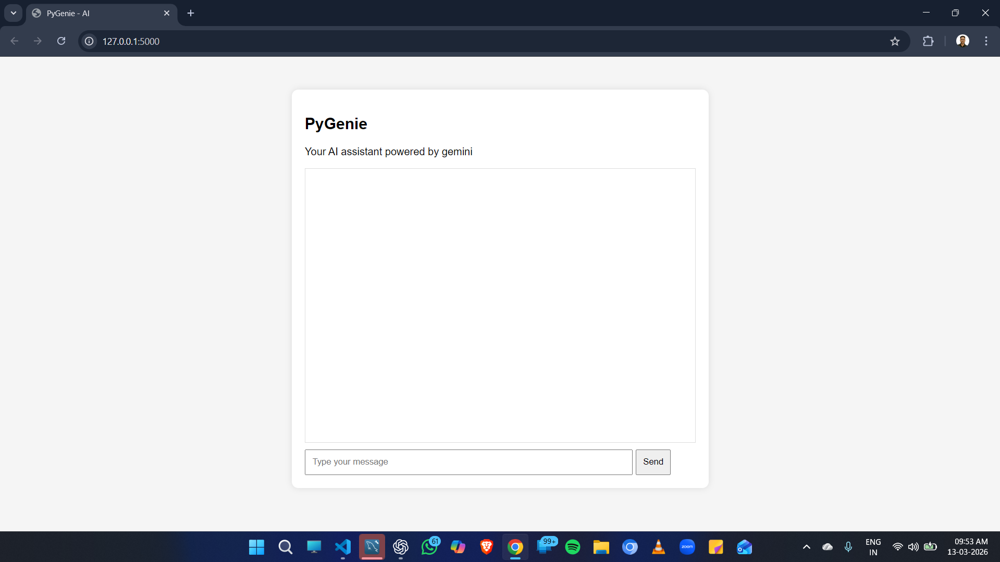

# PyGenie – AI Chatbot

PyGenie is an AI-powered chatbot built using Python and Flask.  
It integrates Google Gemini API to generate intelligent responses through a simple web chat interface.

## Tech Stack
- Python
- Flask
- Google Gemini API
- HTML, CSS, JavaScript

## Screenshots

### Chat interface

### AI Response

## Run Locally

Clone the repo:

git clone https://github.com/aman-k-rai/pygenie-ai-chatbot.git

Install dependencies:

pip install flask google-generativeai

Run the app:

python app.py

Open in browser:

http://127.0.0.1:5000
